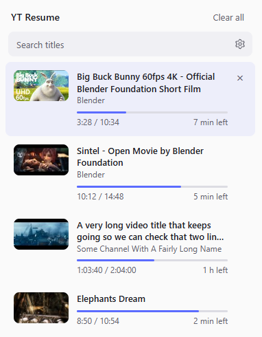
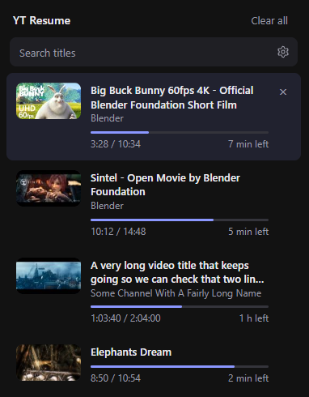

# YT Resume

A small Chrome extension that remembers where you left off in YouTube videos and resumes from there.

## Screenshots

| Light | Dark |
| --- | --- |
|  |  |

The popup follows your system theme. Screenshots use sample data.

<!-- TODO: add demo GIF here, e.g.  -->
*Demo GIF coming soon.*

## Features

- Resumes videos where you stopped, across reloads and restarts, including when you move between videos.
- Waits out pre-roll ads before resuming.
- A small "Resumed at 1:57" toast in the player's bottom-left for 6 s whenever a saved position applies, with a **Start over** button that jumps to 0:00 and forgets the saved position. It also shows when YouTube already resumed near the same spot.
- Resumes a few seconds early (default 3 s, configurable) so you catch the context.
- Popup with saved videos (thumbnail, title, channel, progress bar, time left), title search, and delete or clear all. Light and dark follow your system theme.
- Playlist aware: videos watched in a playlist reopen in it.
- Options page for the on/off switch, minimum video length, finished threshold and max stored videos.
- Skips short videos and live streams, and forgets videos you finish.
- Plain JavaScript, no build step, no dependencies. Only the `storage` permission.

## Install (Load unpacked)

1. Clone or download this repository.
2. Open `chrome://extensions` and turn on **Developer mode**.
3. Click **Load unpacked** and select the folder containing `manifest.json`.

After editing a file, reload the extension card and your YouTube tabs.

## Options

Right-click the toolbar icon and choose **Options**. Changes apply immediately, with no page reload.

| Setting | Default |
| --- | --- |
| Enabled | on |
| Minimum video length | 60 s |
| Finished threshold | 15 s |
| Maximum stored videos | 500 |
| Rewind on resume | 3 s (0 to 30) |

## How it works

- **Content script** (`content.js`) runs on `youtube.com`, tracks the main `<video>` on pages with a `v` parameter, and needs no background worker.
- **Storage:** positions are kept in `chrome.storage.local` as `v:<videoId>` with time, duration, title, channel and playlist. Writes happen at most every 5 s while playing, and on pause, tab hidden and page close. Entries older than 90 days are pruned, and the newest are kept up to your maximum. Settings are stored under `settings`, and open tabs pick up changes through `storage.onChanged`.
- **Resuming:** once per video load, it compares the playhead with the saved position (minus the rewind, never below 0:00). If they are more than 5 s apart it seeks to the target, which overrides YouTube's own watch-history resume when that picked a different spot. If the playhead is already within 5 s it doesn't seek. Either way the toast shows, with the time you resumed at. Nothing happens if the saved position is 10 s or less, the URL has a `t` parameter, the extension is off, or an ad is playing (the toast appears once the ad ends). The toast is built with DOM APIs and styled by `toast.css` under a `ytr-` class prefix, and is never shown over an ad.
- **SPA navigation:** YouTube doesn't reload between videos, so it saves the outgoing video on `yt-navigate-start` and sets up the new one on `yt-navigate-finish`.
- **Ads:** nothing is saved or seeked while `#movie_player` has `ad-showing`. After a pre-roll, a `MutationObserver` resumes once the ad ends.

## Known limitations

- No YouTube Shorts.
- No sync across devices; data is per browser profile.
- It depends on YouTube's page markup and events, so a redesign could break it. The channel name in particular is read from the page and may be missing.

## Privacy

All your data stays on your device in `chrome.storage.local`, and there is no analytics or tracking. It reads only the video ID, title, channel, current time and duration of videos you watch on youtube.com.

The one network request is the popup's thumbnails: opening it loads `https://i.ytimg.com/vi/<id>/default.jpg` from YouTube's image server for each saved video, so YouTube sees those video IDs and your IP address, just as when you browse YouTube. Nothing else is sent. **Clear all** in the popup, or removing the extension, deletes the saved data.

## Quick check

Play a video past 0:30, wait a few seconds, and reload: it should jump back. Open the popup to see it listed, then try `&t=120s` in the URL to confirm a timestamp link wins over the saved position.

## License

[MIT](LICENSE)
